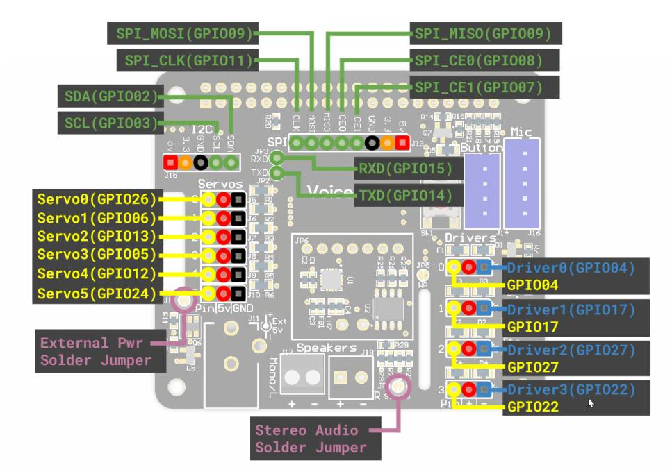
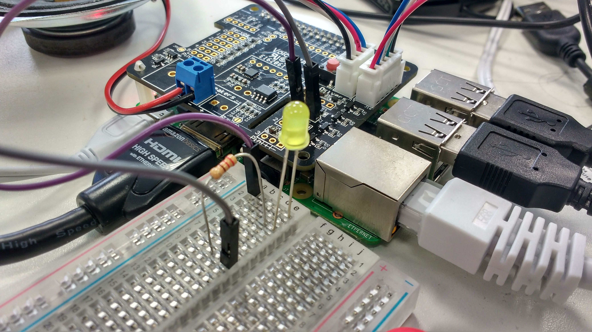

## Controlling the World with Google AIY

The Google AIY Voice Kit came free with the May, 2017 issue of the MagPi, so well done if you have managed to acquire one. If you haven't yet managed to get a Voice Kit, then you can join a waiting list to receive a notification when they are available by signing up [here](https://docs.google.com/forms/d/e/1FAIpQLSev7IQBFUaDlv5tx1Decxd5Ya5AqYSEvD72hJySeaRDogaqAw/viewform?c=0&w=1)

--- step ---
## Solder on header pins

In this project you're going to use the Voice Kit to make an LED blink with a voice command. If you can blink an LED then there really are very few limits on what you can control.

The first thing to do is to set up the Voice Kit HAT. As you will be blinking an LED, you will need to use some soldered header pins to allow you to access the GPIO pins of the Raspberry Pi

You can solder a set of three header pins to the holes on the board that are in the column of **Drivers**. In particular, you want row **1**.

You can see the mapping of all the GPIO pins on the following schematic, in case you want to use different GPIO pin.



And here is a photograph showing the three soldered header pins.


If you have never soldered before, and need some help, then have a look at our [Getting Started With Soldering](https://www.raspberrypi.org/learning/getting-started-with-soldering/) resource.

--- /step ---

--- step ---
## Setting up the hardware

You can follow the [build guide on the Google AIY website](https://aiyprojects.withgoogle.com/voice/#assembly-guide-4-put-it-all-together) if you want. However, it uses the cardboard box to house the kit, and this will restrict access to the GPIO pins. If you want to follow a simple guide then you can use the instructions below.

--- collapse ---
---
title: Assembling the Voice Kit
---
[[[rpi-aiy-voice-assemble]]] 
--- /collapse ---
--- /step ---

--- step --- 
## Install the Software

If you like, you can install the software for the Voice Kit manually. Google have [this guide](https://aiyprojects.withgoogle.com/voice/#makers-guide) to take you through the process. It is far easier, however, to use their image on an SD card.

You can download [their image here](https://dl.google.com/dl/aiyprojects/voice/aiyprojects-latest.img.xz), and if you want guidance on how to burn an image to an SD card then have a look at our [guide here](https://www.raspberrypi.org/learning/software-guide/quickstart/)

The Google image comes as `.xz` file. To extract this on Linux you can install `unxz`.

``` bash
sudo apt update && sudo apt install unxz -y
unxz aiyprojects-2017-05-03.img.xz
```

On Windows or MacOS **Etcher** should handle this for you.

Then just insert your SD card and boot your Raspberry Pi.
--- /step ---

--- step ---
Once your Raspberry Pi has booted, you're going to need some credentials from Google, for this to work. Follow the steps below to enable the Google Assistant API.

--- collapse ---
---
title: Setting up the Assistant API
---
[[[generic-api-google-assistant]]]
--- /collapse ---

Your secrets file that you downloaded will be called something like `client_secret_89351974213-jsno1i2s7lu9mv4q9bjbf3pas6cpnbe5.apps.googleusercontent.com.json`. This needs renaming and placing in your `/home/pi` directory. The new name should be `assistant.json`.

--- /step ---
--- step ---

## Test it's working

With the hardware and software all set up, you need to test that your Voice Kit is working.

- Click on the **Start dev terminal** icon on the desktop, to open a terminal.


- To start the program manually you can simply type `src/main.py` into the *Terminal**

- If this is the first time you have run the program, **Chromium** will open and ask you to login and authorise the use of the Google API.


- Click **ALLOW** to enable access to the API. Now you should be able to use the button to begin capturing your voice commands. There are several built in instructions that you can use. Try saying any of the following after pushing the button:
  - *"What are the three laws of robotics"*
  - *"What is the time?"*
  - *"IP Address"*

- You can also ask it questions that will result in a simple Google search
  - *"Who is the Prime Minister"*
  - *"What is the air-speed velocity of an unladen swallow"*
  
- Have a good play with the device before learning how to hack it to create your own voice commands.
--- /step ---

--- step ---
## Simple voice responses

The AIY Voice kit software allows you to add your own simple voice commands that will provide simple responses.

- Using a text editor or IDLE, open the file called `action.py`. You can find it at `/home/pi/voice-recognizer-raspi/action.py`.

- Most of this file contains instructions on how to use it, but if you scroll past the first set of comments, you should see the following code:

``` python
class SpeakAction(object):

    """Says the given text via TTS."""

    def __init__(self, say, words):
        self.say = say
        self.words = words

    def run(self, voice_command):
        self.say(self.words)
```
- This `class` does a few simple things. Don't worry if you're not too familiar with classes, as understanding what it does is more important.
  - The class starts by initialising (`__init__`) an object with two things. `self.say` is a special function defined in another file. This function handles all the complicated conversion of text to speech.
    - The class also initialises an object with `self.words`. This is again a sting, and represents what you want the Voice Kit to respond through the speaker. If `self.words` was the string `"I'm fine, thank you"`, then that is what the Voice Kit would respond.
  - The class has a `run` method. This has a `voice_command` parameter. The `voice_command` are all the words that you speak into the microphone.
  - In the run function are the actions that you need to be performed. In this case the `self.say(self.words` will just convert a string to speech for output through the speaker.
  
- To use this class, scroll down the code and have a look at the section where it says the following:

``` python
    # =========================================
    # Makers! Add your own voice commands here.
    # =========================================
```

- Here's where you can add some simple voice commands and their associated responses. Underneath the comment, you can now add your own action. Try adding the following lines and make sure that you keep the indentation.

``` python
    # =========================================
    # Makers! Add your own voice commands here.
    # =========================================
	actor.add_keyword(_("what's up"), SpeakAction(say, "I'm fine, thank you"))
```

- So what does this line do? `actor.add_keyword(_("what's up")` instructs the code to listen out for the keywords *"what's up"* to be spoken. When the keywords are recognised then the code within the `SpeakAction` class is run. What is passed in is the command the user spoke (`say`) and the string `"I'm fine, thank you"`. The `SpeakAction` code that you looked at earlier then outputs that string through the microphone.

- Have a go at running this code, and test that it's working.

- Now try adding your own set of keywords and responses underneath the one you have just written.

--- /step ---

--- step ---
## Making your own actions

- An action is the thing that you want your voice kit to do. Below is about the most basic action you can come up with.

```python
class PrintHelloWorld():
	"""Prints Hello World!"""

	def run(self, voice_command):
	    print("Hello World!")
```

- All this will do is print `Hello World!` to the console when you run the program. If you add the following voice command in, you can test this out.

```python
    actor.add_keyword("hello world", PrintHelloWorld())
```

- Have a play around with this an see what else you can get the voice kit to do.
--- /step ---

--- step ---
## Controlling an LED

Now is your chance to try and make an LED turn on and off again when an command is given. Alter the code so that when the command "LED" is spoken, the LED turns on, stays on for 5 seconds, then switches off.

--- hints ---

--- hint ---
1. Wire up an LED and a resistor to the header pins you soldered on.
2. Somewhere near the top of the file, you will need to import the `LED` class from the `gpiozero` module. You'll also want the `sleep` function from the `time` module.
3. You will want to create an `led` object on pin 17.
4. When the command to turn on the led is given, the `led.on()` method should be called, there should be a pause for a few seconds, then the `led.off()` method should be called.
--- /hint ---

--- hint ---

--- /hint ---

--- hint ---
TODO - ADD IN SCREEN CAST MAKING THE FUNCTION
--- /hint ---
--- /hints ---
--- /step ---

--- step ---

## Getting some feedback

It would be nice if you could get the class you have written to give some verbal feedback when the LED switches on and off again. To do this you will need to use that `say` function that was discussed earlier.

To use the `say` function it needs to be included in the `actor.keyword` call. It can then be used in the class when you initialise the class.

- First you can alter your command section of the script. The `ControlLED` needs to use the `say` function and to be passed a string.

``` python
    actor.add_keyword('LED', ControlLED(say, 'turning on LED'))
```

- Now that you're using some parameters with your `ControlLED` class, you need to make sure you can use them in the class' methods. You do this in the initialisation method.

```python
class ControlLED():
    """Turns on an LED for 5 seconds"""

    def __init__(self, say, response):
        self.say = say
        self.response = response
```

- Now within your `run` method you can call `self.say` and pass it `self.response`.

``` python
    def run(self, voice_command):
        self.say(self.response)
        led.on()
        sleep(5)
        led.off()
```

## Using `voice_command`

Now that you can turn the LED on with a voice command, it would be nice if you could get it to stay on, until another voice command turns it off again.

Here's the basic logic that you will need to follow.

- If the keyword LED is used, then use the ControlLED class
- If the `voice_command` contains the word **on** then turn the LED on
- If the `voice_command` contains the word **off** then turn the LED off.

You can have a look at the section below, to learn how to find a specific sequence of characters within a string using python, if you need help.

--- collapse ---
---
title: Finding strings in strings
---
[[[generic-python-finding-substrings]]]
--- /collapse ---

--- hints ---
--- hint ---
- Your trigger should remain the same - listening for the LED key word.
- Within the `run` method can use the `voice_command`. If the `voice_command` contains the string `on` then the LED can tun on. If the voice command contains the string `off` then the LED turns off
--- /hint ---
--- hint ---
Here's a little code to get you started:
``` pyton
    def run(self, voice_command):
		command = 
		if "on" in command:
			self.say('Turning LED on')
			
		elif #something here :
			self.say('Turning LED off')
```
--- /hint ---
--- hint ---
Here's a little video showing you how to write the code.

--- /hint ---
--- /hints ---
--- /step ---

--- step ---
--- challenge ---
- Can you make the LED blink when the user asks it to blink?
- Can you use voice commands to control the speed of the blinking?


--- /challenge --
--- step ---

